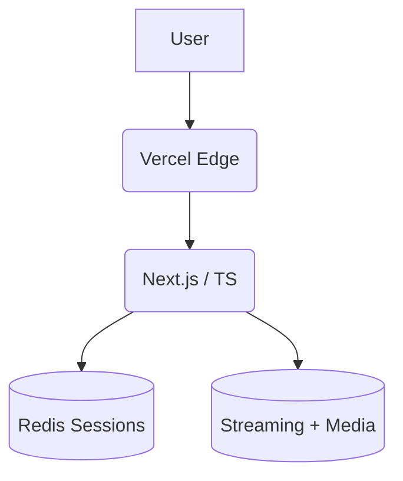
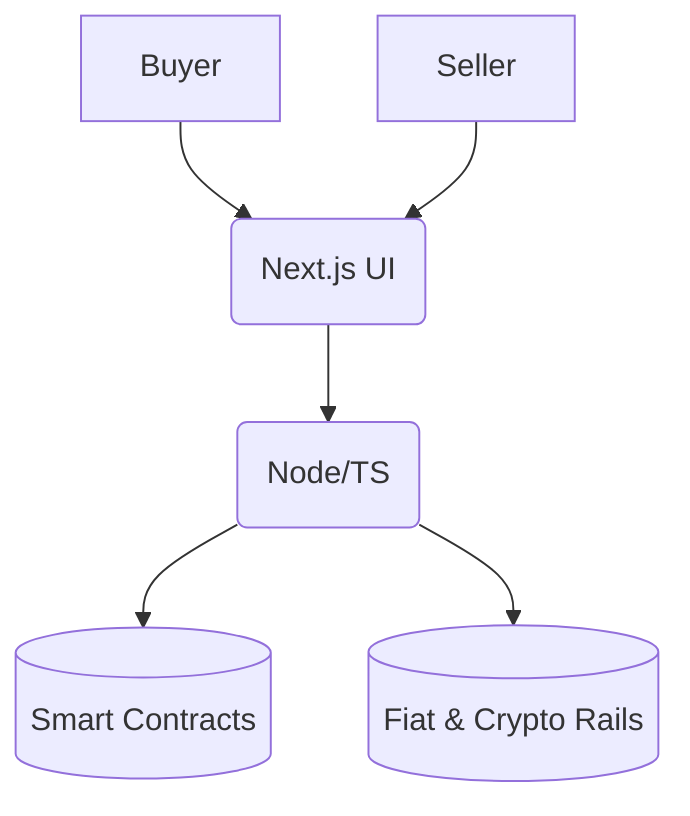
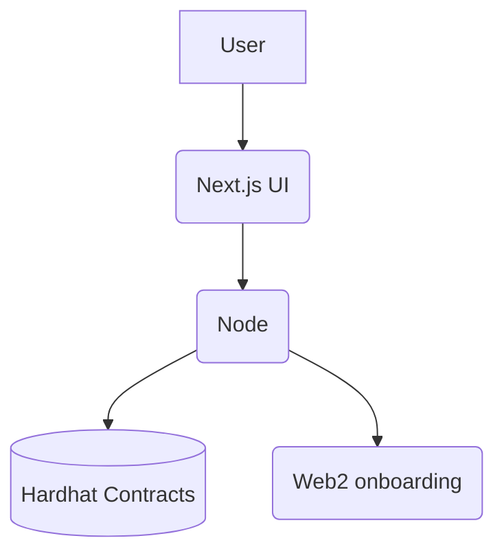
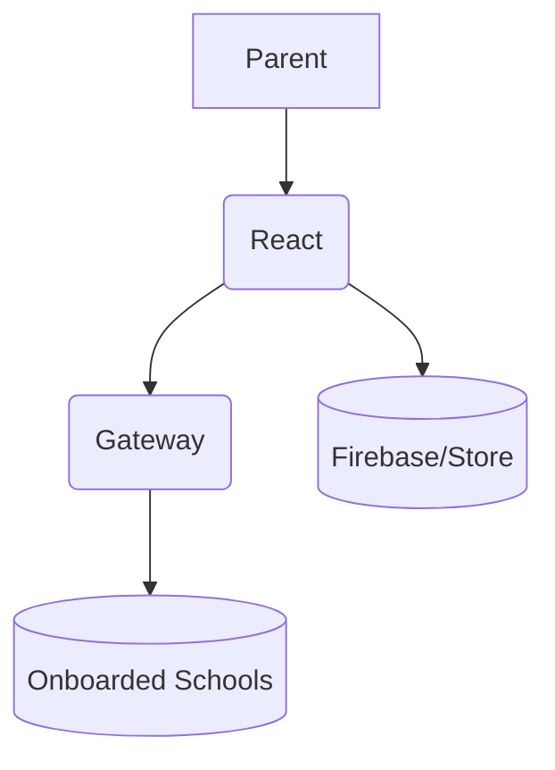
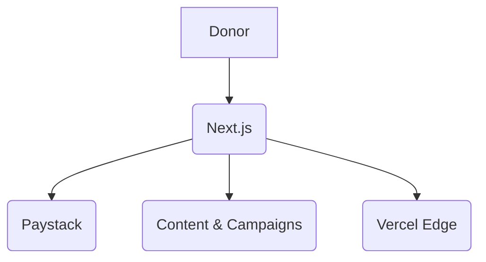

# Hi, I'm Elshaddai Oheha

Backend architect & full-stack engineer bridging Web2 reliability with Web3 trust. I build high-concurrency products, resilient data flows, and animated, performant interfaces.

## Skills

- Frontend: React, Next.js, TypeScript, Tailwind, Framer Motion
- Backend: Node.js, Express, Redis, PostgreSQL, MongoDB
- Web3: Solidity, Hardhat, Hedera, Wallet integration
- Infra: Docker, Vercel, CI, caching, perf budgets

## Featured Projects

### TEBI LMS — https://tebiglobal.vercel.app
Badges:    

Architecture (Mermaid):

Challenges Overcome:
- Sustained 1k+ concurrent learners with Redis session caching to keep latency low.
- Tuned video bitrate for low-data networks without quality collapse.
- Event-first onboarding to help planners ship courses fast.

### Swen-Autos — https://swen-autos.vercel.app
Badges:   

Architecture (Mermaid):

Challenges Overcome:
- Blockchain-backed listing identity to curb counterfeits.
- Multi-rail checkout (fiat + crypto) with escrow safety.
- Search/listing performance tuned for low-bandwidth devices.

### Agbejo — https://agbejo.vercel.app
Badges:   

Architecture (Mermaid):

Challenges Overcome:
- Hardhat-compiled escrow contract for token swaps.
- Web2-to-Web3 bridge so non-crypto users can swap smoothly.
- Low-latency swap execution across multiple tokens.

### Breezefee — https://breezefee-32f69.web.app/
Badges:   

Architecture (Mermaid):

Challenges Overcome:
- Peak-term concurrency handled with responsive, idempotent payment submission.
- Clear parent-to-school receipt flows for term/session fees.
- Mobile-first checkout for guardians.

### Oloja Foundation — https://theolojafoundation.vercel.app
Badges:   

Architecture (Mermaid):

Challenges Overcome:
- Multi-donor checkout with Paystack for recurring giving.
- Media and hero optimization for emerging-market bandwidth.
- Campaign pages structured for transparent impact reporting.

## Portfolio
- Live site: https://0hehaebib1.vercel.app
- Code: https://github.com/elshaddaioheha/0hehaebib1
