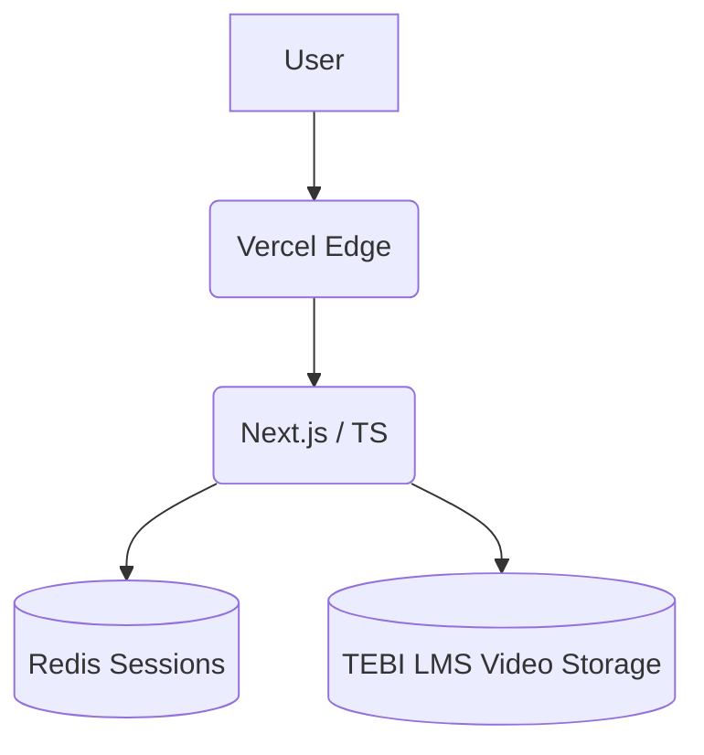
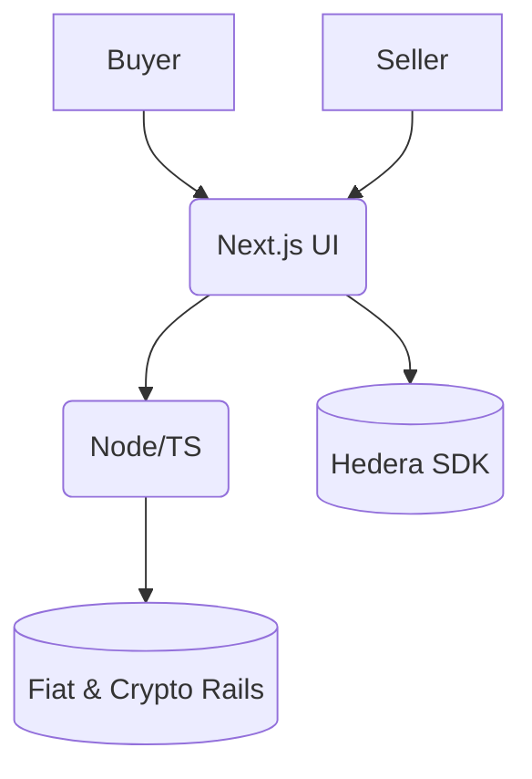
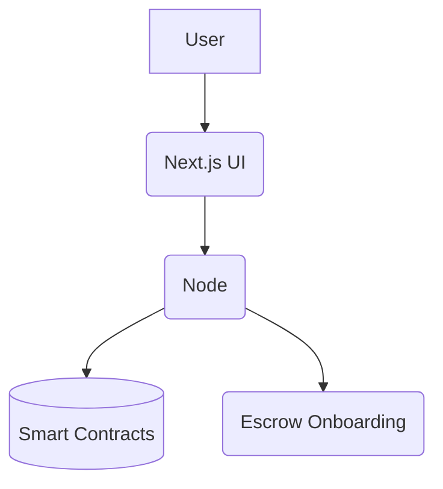
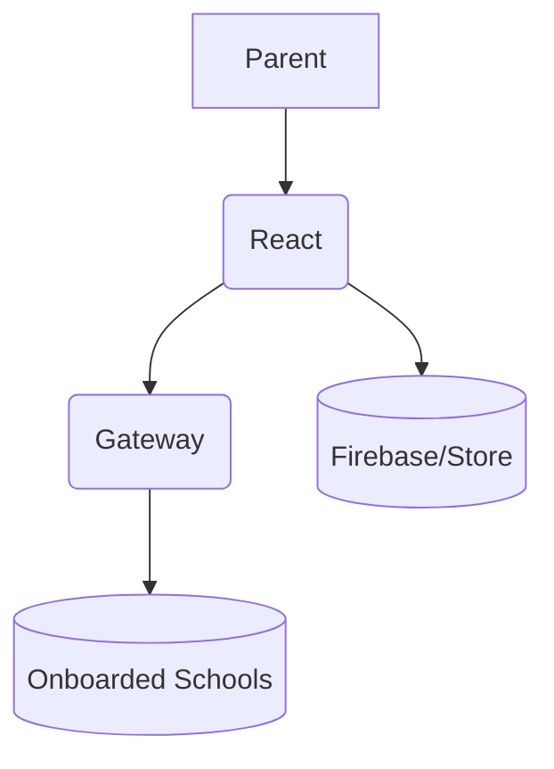
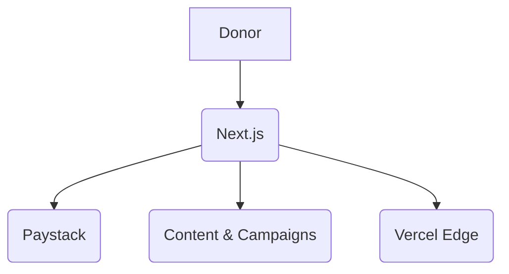

# Hi, I'm Oheha Ebibi

Software engineer & full-stack developer. I build high-concurrency products, resilient database layers, and animated, performant interfaces.

## Skills

- Frontend: JavaScript, React, Tailwind, Framer Motion
- Backend: Node.js, Express
- Databases: Supabase, Firebase, MongoDB
- DevOps & Blockchain: Docker, Hedera SDK

## Featured Projects

### Diamond Dreams Group — https://diamonddreamsgroup.com
Badges:    

Architecture (Mermaid):

Challenges Overcome:
- Unified event planning platform and integrated TEBI LMS, handling 1k+ concurrent learners with Redis session caching.
- Tuned video bitrate for low-data networks to ensure smooth course streaming.

### Swen-Autos — https://swen-autos.vercel.app
Badges:   

Architecture (Mermaid):

Challenges Overcome:
- Integrated Hedera listing validation to ensure listing authenticity.
- Multi-rail checkout (fiat + crypto) with escrow security features.
- Search/listing performance tuned for low-bandwidth devices.

### Agbejo — https://agbejo.vercel.app
Badges:   

Architecture (Mermaid):

Challenges Overcome:
- Enforced automated escrow swaps on-chain using secure smart contracts.
- Low-latency verification and transaction handling.

### Breezefee — https://breezefee-32f69.web.app/
Badges:   

Architecture (Mermaid):

Challenges Overcome:
- Peak-term concurrency handled with responsive, idempotent payment submission.
- Clear parent-to-school receipt flows for term/session fees.
- Mobile-first checkout for guardians.

### Oloja Foundation — https://theolojafoundation.vercel.app
Badges:   

Architecture (Mermaid):

Challenges Overcome:
- Multi-donor checkout with Paystack for recurring giving.
- Media and hero optimization for emerging-market bandwidth.
- Campaign pages structured for transparent impact reporting.

## Portfolio
- Live site: https://0hehaebib1.vercel.app
- Code: https://github.com/elshaddaioheha/0hehaebib1
